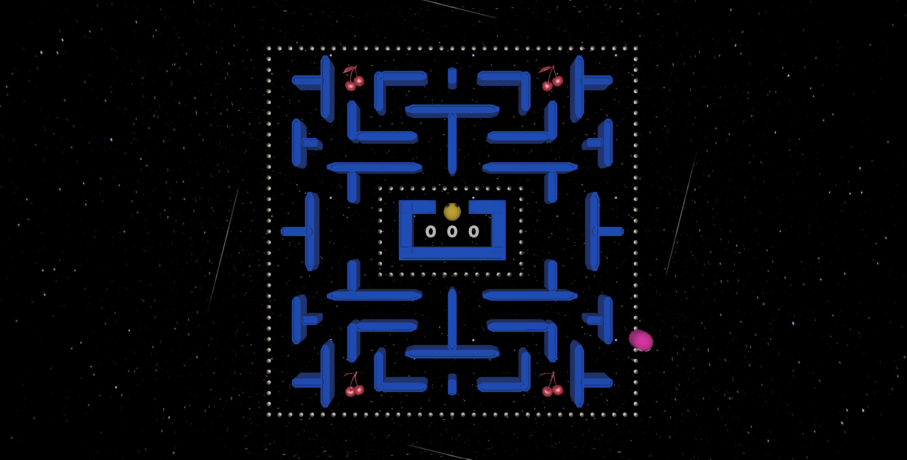
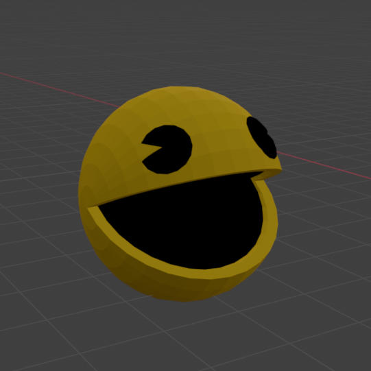
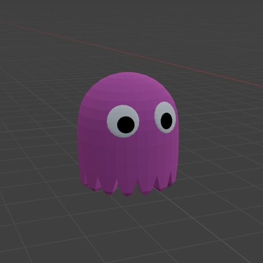
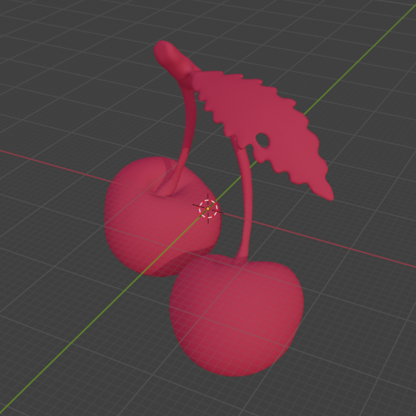
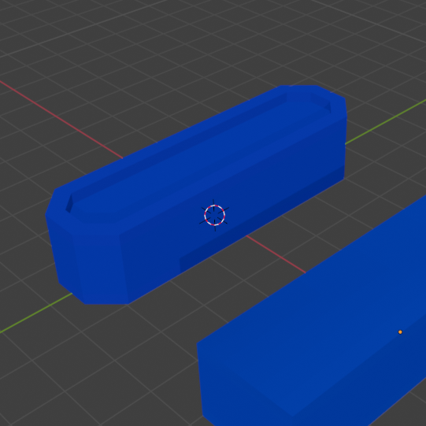
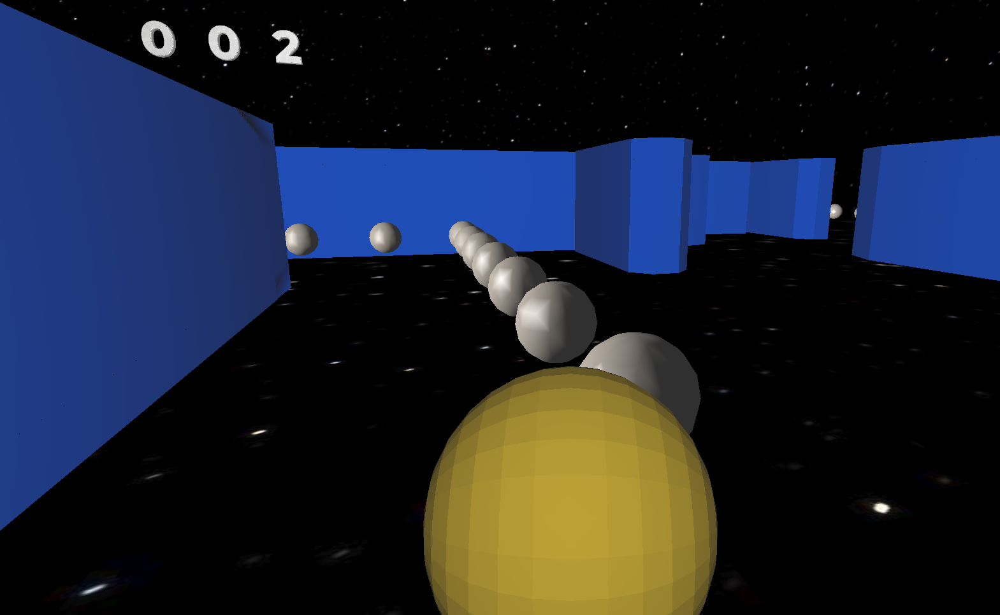
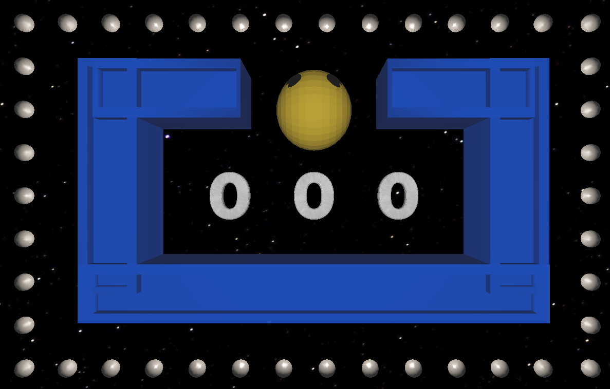
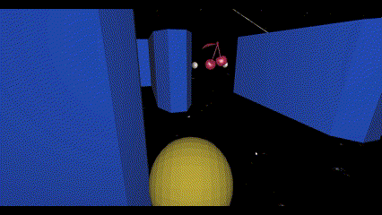
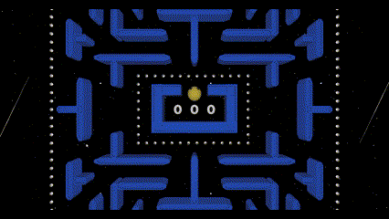

# Trabalho Final

Repositório para o trabalho final da cadeira de Fundamentos de Computação Gráfica. Implementação em C++ e OpenGL de uma aplicação gráfica interativa baseada no jogo eletrônico de labirinto criado por Toru Iwatani em 1980, Pac-Man.

# Setup

Para compilar e executar este projeto, você possui as seguintes opções

## Windows

### Windows com VSCode (Visual Studio Code)
1) Instale o VSCode seguindo as instruções em https://code.visualstudio.com/ .

2) Instale o compilador GCC no Windows seguindo as instruções em
https://code.visualstudio.com/docs/cpp/config-mingw#_installing-the-mingww64-toolchain .

Alternativamente, se você já possui o Code::Blocks instalado no seu PC (versão que inclui o MinGW), você pode utilizar o GCC que vem com esta instalação no passo 5.

3) Instale o CMake seguindo as instruções em https://cmake.org/download/ .
Alternativamente, você pode utilizar algum package manager do
Windows para fazer esta instalação, como https://chocolatey.org/ .

4) Instale as extensões "ms-vscode.cpptools" e "ms-vscode.cmake-tools" no VSCode. Se você abrir o diretório deste projeto no VSCode, automaticamente será sugerida a instalação destas extensões (pois estão listadas no arquivo ".vscode/extensions.json").

5) Abra as configurações da extensão cmake-tools (Ctrl-Shift-P e busque por "CMake: Open CMake Tools Extension Settings"), e adicione o caminho de instalação do GCC na opção de configuração "additionalCompilerSearchDirs".

Por exemplo, se você quiser utilizar o compilador MinGW que vem junto com o Code::Blocks, pode preencher o diretório como
"C:\Program Files\CodeBlocks\MinGW\bin" (verifique se este é o local de instalação do seu Code::Blocks).

6) Clique no botão de "Play" na barra inferior do VSCode para compilar e executar o projeto. Na primeira compilação, a extensão do CMake para o VSCode irá perguntar qual compilador você quer utilizar. Selecione da lista o compilador GCC que você instalou com o MSYS/MinGW.

Veja mais instruções de uso do CMake no VSCode em:

https://github.com/microsoft/vscode-cmake-tools/blob/main/docs/README.md

## Linux
Para compilar e executar este projeto no Linux, primeiro você precisa instalar
as bibliotecas necessárias. Para tanto, execute o comando abaixo em um terminal.
Esse é normalmente suficiente em uma instalação de Linux Ubuntu:

    sudo apt-get install build-essential make libx11-dev libxrandr-dev \
                         libxinerama-dev libxcursor-dev libxcb1-dev libxext-dev \
                         libxrender-dev libxfixes-dev libxau-dev libxdmcp-dev

Se você usa Linux Mint, talvez seja necessário instalar mais algumas bibliotecas:

    sudo apt-get install libmesa-dev libxxf86vm-dev

Após a instalação das bibliotecas acima, você possui várias opções para compilação:

### Linux com Makefile

Abra um terminal, navegue até a pasta "fcg-trabfinal", e execute
o comando "make" para compilar. Para executar o código compilado, execute o
comando "make run".

### Linux com CMake
Abra um terminal, navegue até a pasta "fcg-trabfinal", e execute os seguintes comandos:

    mkdir build  # Cria diretório de build
    cd build     # Entra no diretório
    cmake ..     # Realiza a configuração do projeto com o CMake
    make         # Realiza a compilação
    make run     # Executa o código compilado

### Linux com VSCode
1) Instale o VSCode seguindo as instruções em https://code.visualstudio.com/ .

2) Instale as extensões "ms-vscode.cpptools" e "ms-vscode.cmake-tools" no VSCode. Se você abrir o diretório deste projeto no VSCode, automaticamente será sugerida a instalação destas extensões (pois estão listadas no arquivo ".vscode/extensions.json").

3) Clique no botão de "Play" na barra inferior do VSCode para compilar e executar o projeto. Na primeira compilação, a extensão do CMake para o VSCode irá perguntar qual compilador você quer utilizar. Selecione da lista o compilador que você deseja utilizar.

Veja mais instruções de uso do CMake no VSCode em:

https://github.com/microsoft/vscode-cmake-tools/blob/main/docs/README.md

## macOS
Para compilar e executar esse projeto no macOS, primeiro você precisa instalar o HOMEBREW, um gerenciador de pacotes para facilitar a instação de bibliotecas. O HOMEBREW pode ser instalado com o seguinte comando no terminal:

    /usr/bin/ruby -e "$(curl -fsSL https://raw.githubusercontent.com/Homebrew/install/master/install)"

Após a instalação do HOMEBREW, a biblioteca GLFW deve ser instalada. Isso pode ser feito pelo terminal com o comando:

    brew install glfw

### macOS com Makefile
Abra um terminal, navegue até a pasta "fcg-trabfinal", e execute o comando "make -f Makefile.macOS" para compilar. Para executar o código compilado, execute o comando "make -f Makefile.macOS run".

Observação: a versão atual da IDE Code::Blocks é bastante desatualizada pra o macOS. A nota oficial dos desenvolvedores é: "Code::Blocks 17.12 for Mac is currently not available due to the lack of Mac developers, or developers that own a Mac. We could use an extra Mac developer (or two) to work on Mac compatibility issues."

## Soluções de Problemas

Caso você tenha problemas de compilação no Windows com GCC, cuide para extrair o código em um caminho que não contenha espaços no nome de algum diretório:

- Caminho OK: C:\Users\JohnDoe\Documents\FCG\Lab1

- Caminho NÃO OK: C:\Users\JohnDoe\Documents\Fundamentos de CG\Lab1

Caso você tenha problemas em executar o código deste projeto, tente atualizar o driver da sua placa de vídeo.

# Controles

| Tecla  | Função |
| -------|------- |
| WASD  | Movimentação do personagem e da câmera |
| F  | Mudança de câmera (look-at/free cam) |
| O  | Visualização em projeção ortográfica |
| P  | Visualização em projeção perspectiva |

# Processo de desenvolvimento e funcionalidades

O projeto foi construído a partir dos Laboratórios desenvolvidos em aula, especialmente os Laboratórios 4 e 5. Funcionalidades como movimentação de câmera, carregamento de objetos e texturas, iluminação e transformações matriciais foram em grande parte aproveitadas dos Laboratórios. Procurou-se reorganizar a distribuição de funções em diferentes arquivos para minimizar as funções do arquivo main.cpp, mas vemos que ainda poderiam ser feitas melhorias na eficiência e organização do código.

## Malhas poligonais

O jogo possui quatro [objetos](./resources/models/) principais (Pac-man, Fantasma, Esfera, Cereja), dois modelos de paredes (quadrada e arredondada), assim como objetos correspondentes aos números de 0-9 que servem para a visualização do score do usuário. Os objetos foram editados no Blender conforme necessário.

  
  
  
  

Todas as esferas do jogo reutilizaram o mesmo objeto, assim como as cerejas e as paredes. Todos os objetos compartilham o model com outros objetos.

## Interação com usuário

Além do controle do personagem, o usuário também tem controle sob a orientação da câmera a partir do movimento do mouse (somente na visualização free cam) e do zoom da câmera atráves do movimento de scroll do mouse (somente na visualização look-at). Transformações geométricas foram aplicadas nos personagens baseadas na movimentação realizada pelo usuário, usando as teclas WASD o Pac-man gira de acordo com a direção desejada, por exemplo. Ao colidir/comer uma cereja o Pac-man tem sua velocidade alterada por tempo determinado.

## Modelos de câmera

Foram implementadas as câmeras 'free cam' e 'look-at cam'. Em ambas visualizações o usuário pode usar os comandos WASD para controle do personagem. A projeção ortográfica ficou limita à câmera 'look-at'.

  
  

## Testes de intersecção

Em ambas as vistas (free cam e look-at) foram utilizados três tipos de testes de [colisão](./include/collisions/collisions.hpp): Esfera-Esfera, Esfera-Caixa e Esfera-Plano. A colisão Caixa-Plano foi implementada porém não está em uso.

  
  

## Modelos de iluminação e interpolação

Para iluminação foram utilizados os modelos de Lambert (difusa) e Blinn-Phong implementados no [shader fragment](./resources/shaders/shader_fragment.glsl).

Para interpolação foram utilizados os modelos de Phong e Gouraud. O último foi implementado no [shader vertex](./resources/shaders/shader_vertex.glsl) e aplicado às esferas do jogo em ambas as vistas.

## Mapeamento de texturas

Todos objetos do jogo possuem [texturas](./resources/textures/). O objeto do Pac-man e dos Fantasmas utilizaram as coordenadas de textura presentes nos arquivos '.obj' e suas texturas foram criadas no Blender através da ferramenta de 'Bake'. Também foram utilizadas as projeções esférica (esferas e cerejas), cúbica (fundo) e planar (piso) para mapeamento das texturas em outros objetos.

## Curva de Bézier

Durante a inicialização do jogo foi adicionada uma animação para a entrada do Pac-man no labirinto que utiliza uma curva cúbica de Bézier.

## Contribuição

**Gabriela Copetti Maccagnan**
- Adição do fundo Skybox e renderização de objetos
- Adição das câmera livre e look-at
- Carregamento de texturas e customização de Bake Textures
- Modelos de Iluminação e Interpolação
- Movimentação de personagem (Fantasma)

**Giulia Chimini Stefainski**
- Movimentação de câmera e de personagem (Pac-man)
- Sincronização de movimento em ambas câmeras
- Renderização de objetos com múltiplas instâncias
- Testes de intersecção e resolução
- Animação com curva de Bézier

## Uso de IA

Neste projeto fez-se uso de ferramentas de IA como ChatGPT e GitHub Copilot para auxílio durante a implementação, em especial para refatoração de códigos, entendimento de funções existentes e erros de compilação, ajustes de movimentação de câmera e de testes de colisão. Essas ferramentas foram muito úteis para o ínicio do desenvolvimento, ajudando a aprimorar o código, porém em situações mais específicas, em que um contexto maior da aplicação era necessário para o entendimento dos prompts elas nem sempre geravam bons resultados.
